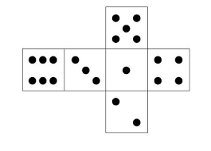

# documentation

la seule bibliothèqUE requise est <span style="color: #f01a2c">'IRremote_h'</span> 
elle sert a gérer tout ce qui est capteur infrarouge pour plus d'information voici la   
[documentation](https://github.com/Arduino-IRremote/Arduino-IRremote).
##  Fonctions
concernant les fonctions elle s'oganisnent de un a six dans l'ordre croissant(one = 1 et 6 = six) :  
  


 

## LED 
__concernant les leds elles sont anoté de d1 a d7 comme montré dans le schéma ci dessous:__  

  

pour suivre le pattern du dés j'ai renomé mes variables de leds de la meme façon avec  <span style="color: #85ff91">#define</span> *nom de variable* NB_pin.  
**exemple:**
```C++
#define D1 11
#define D2 12
#define D3 13
#define D7 10
#define D4 9
#define D5 8
#define D6 7
```
##led RGB 
j'ai codé une fonction leds rgb spéciale qui utulise le format r g b et chaque couleure est définie entre 0 et 255 :
```C++
void displayColor(byte r, byte g, byte b) {

  // Assigne l'état des broches
  // Version cathode commune
  //analogWrite(PIN_LED_R, r);
  //analogWrite(PIN_LED_G, g);
  //analogWrite(PIN_LED_B, b);

  // Version anode commune
  analogWrite(PIN_LED_R, ~r);
  analogWrite(PIN_LED_G, ~g);
  analogWrite(PIN_LED_B, ~b);
}
```
les pins pour le rouges pour le bleu  et le vert son défini entre la ligne 17 et 20 : 
```C++
const byte PIN_LED_R = 6;
const byte PIN_LED_G = 3;
const byte PIN_LED_B = 5; 
```
on définit ensuite le pinmode dans le setup
```C++
pinMode(PIN_LED_R, OUTPUT);
pinMode(PIN_LED_G, OUTPUT);
pinMode(PIN_LED_B, OUTPUT);
```
##  Infrarouge
>il nous suffi de générer une couleure et un nombre aléatoire ensuite a chaque pression de la télécommande.

```C++ 
#define CMDE 4 //nom du capteur infrarouge
#include <IRremote.h> //on inclut la bibliothèque
IRrecv receiver(CMDE); // on crée un récépteur
decode_results results; // create a results object of the decode_results class
unsigned long key_value = 0; // variable qui enregistre la commande préssée 
```
pour générer l'aléatoire on crée une variable de type integer 
```C++ 
int randonNB = random(1,6);
```

et le capteur IR = 0 alors 
on regarde la valeurs de la variable randomNB pour chaque face du dé et si elle est égale a la valeurs d'une face du dé alors la fonction dans le if s'éxecute.
```C++
int randonNB = random(1,6);
if (digitalRead(CMDE) == 0) {
if (randonNB== 1 ){one();
}
if (randonNB== 2 ){two();
}
if (randonNB== 3){tree();
}
if (randonNB== 4 ){four();}
if (randonNB== 5 ){five();
}
if (randonNB== 6 ){six();
}
digitalWrite(3,1);
//led rgb 
displayColor(random(0,255),random(0,255),random(0,255));//on choisi une valeure aléatoire pour vert bleu et rouge 
}//sinon on étend les leds
digitalWrite(PIN_LED_G,0);
digitalWrite(PIN_LED_R,0);
digitalWrite(PIN_LED_B,0);
```
